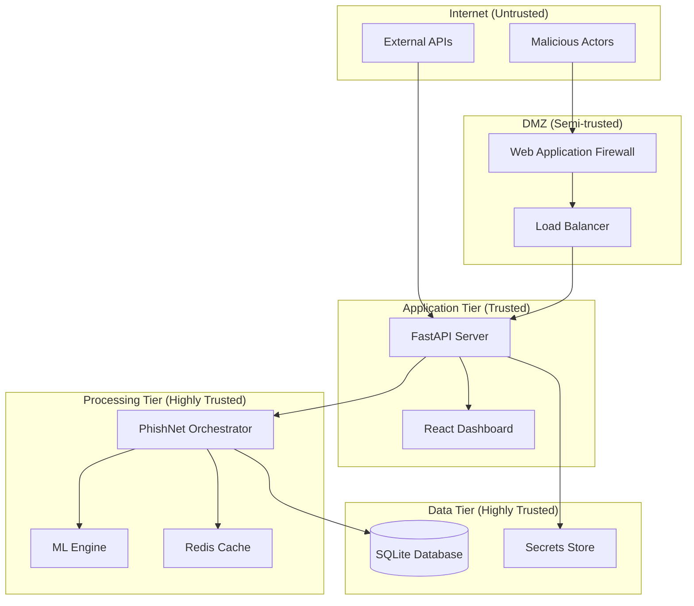
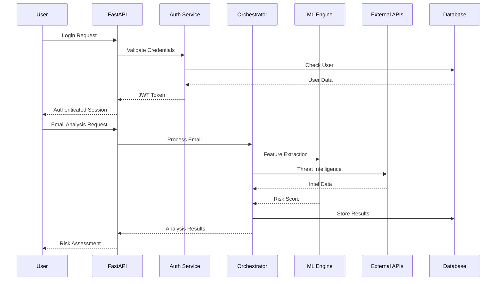

# PhishNet Threat Model

**Document Version:** 1.0  
**Last Updated:** January 2024  
**Classification:** Internal  
**Owner:** Security Team  

## Executive Summary

This document provides a comprehensive threat model for PhishNet, a production-grade email security platform. It identifies potential security threats, vulnerabilities, and corresponding mitigations to ensure robust protection of the system and its data.

## Table of Contents

1. [System Overview](#system-overview)
2. [Assets & Data Flow](#assets--data-flow)
3. [Threat Categories](#threat-categories)
4. [Attack Vectors](#attack-vectors)
5. [Threat Analysis](#threat-analysis)
6. [Security Controls](#security-controls)
7. [Risk Assessment](#risk-assessment)
8. [Mitigation Strategies](#mitigation-strategies)
9. [Monitoring & Detection](#monitoring--detection)
10. [Incident Response](#incident-response)

## System Overview

PhishNet is a multi-tier email security platform consisting of:

- **Frontend**: React-based dashboard for threat analysis and management
- **API Gateway**: FastAPI server with authentication and rate limiting
- **Core Engine**: Orchestration, feature flags, caching, and ML processing
- **External Integrations**: Gmail API, VirusTotal, AbuseIPDB
- **Data Storage**: SQLite database and Redis cache
- **Observability**: OpenTelemetry tracing and Prometheus metrics

### Trust Boundaries



## Assets & Data Flow

### Critical Assets

| Asset | Classification | Description | Impact if Compromised |
|-------|----------------|-------------|----------------------|
| **User Credentials** | Highly Sensitive | JWT tokens, passwords, API keys | Complete system compromise |
| **Email Content** | Sensitive | Raw email data being analyzed | Privacy violation, data breach |
| **ML Models** | Confidential | Trained detection algorithms | Intellectual property theft |
| **Threat Intelligence** | Sensitive | VirusTotal/AbuseIPDB data | Loss of detection capability |
| **System Configuration** | Confidential | Feature flags, security settings | System manipulation |
| **Audit Logs** | Sensitive | Security and access logs | Loss of forensic capability |

### Data Flow Diagram



## Threat Categories

### 1. Authentication & Authorization Threats

#### T1.1 - Credential Compromise
- **Description**: Attackers obtain valid user credentials
- **Attack Vectors**: Password attacks, credential stuffing, phishing
- **Impact**: Unauthorized access to sensitive email data and system controls

#### T1.2 - JWT Token Manipulation
- **Description**: Attackers forge or manipulate JWT tokens
- **Attack Vectors**: Weak signing keys, algorithm confusion, token theft
- **Impact**: Privilege escalation, unauthorized access

#### T1.3 - Session Hijacking
- **Description**: Attackers steal active user sessions
- **Attack Vectors**: XSS, man-in-the-middle, session fixation
- **Impact**: Impersonation, unauthorized actions

### 2. Input Validation Threats

#### T2.1 - SQL Injection
- **Description**: Malicious SQL code execution
- **Attack Vectors**: Unvalidated user inputs, dynamic query construction
- **Impact**: Data breach, data manipulation, system compromise

#### T2.2 - Cross-Site Scripting (XSS)
- **Description**: Malicious script injection in web interface
- **Attack Vectors**: Stored XSS, reflected XSS, DOM-based XSS
- **Impact**: Session theft, data exfiltration, defacement

#### T2.3 - Injection Attacks
- **Description**: Code injection in various contexts
- **Attack Vectors**: Command injection, template injection, NoSQL injection
- **Impact**: System compromise, data breach

### 3. API Security Threats

#### T3.1 - API Abuse
- **Description**: Excessive or malicious API usage
- **Attack Vectors**: Rate limit bypass, DDoS, resource exhaustion
- **Impact**: Service degradation, system unavailability

#### T3.2 - Data Exposure
- **Description**: Sensitive data leaked through APIs
- **Attack Vectors**: Over-privileged endpoints, information disclosure
- **Impact**: Data breach, privacy violation

#### T3.3 - Business Logic Bypass
- **Description**: Circumvention of intended application flow
- **Attack Vectors**: Parameter manipulation, workflow bypass
- **Impact**: Unauthorized operations, data integrity issues

### 4. Infrastructure Threats

#### T4.1 - Container Escape
- **Description**: Breaking out of container isolation
- **Attack Vectors**: Kernel exploits, container misconfigurations
- **Impact**: Host system compromise

#### T4.2 - Supply Chain Attacks
- **Description**: Compromised dependencies or build process
- **Attack Vectors**: Malicious packages, build system compromise
- **Impact**: Complete system compromise

#### T4.3 - Secret Management Failures
- **Description**: Exposure of sensitive configuration data
- **Attack Vectors**: Hardcoded secrets, insecure storage
- **Impact**: System compromise, data breach

### 5. Machine Learning Threats

#### T5.1 - Model Poisoning
- **Description**: Manipulation of ML training data
- **Attack Vectors**: Malicious training samples, data corruption
- **Impact**: Reduced detection accuracy, false negatives

#### T5.2 - Adversarial Attacks
- **Description**: Crafted inputs to fool ML models
- **Attack Vectors**: Evasion attacks, gradient-based perturbations
- **Impact**: Bypass of security controls

#### T5.3 - Model Extraction
- **Description**: Stealing trained ML models
- **Attack Vectors**: API probing, model inversion
- **Impact**: Intellectual property theft

### 6. External Integration Threats

#### T6.1 - API Key Compromise
- **Description**: Theft of external service credentials
- **Attack Vectors**: Key exposure, insufficient rotation
- **Impact**: Service disruption, unauthorized usage costs

#### T6.2 - Man-in-the-Middle
- **Description**: Interception of external communications
- **Attack Vectors**: Certificate validation bypass, DNS poisoning
- **Impact**: Data integrity compromise, false intelligence

#### T6.3 - Service Dependency Failures
- **Description**: Cascade failures from external services
- **Attack Vectors**: Service outages, rate limiting
- **Impact**: System degradation, reduced functionality

## Attack Vectors

### External Attackers

1. **Internet-based Attacks**
   - Web application attacks (OWASP Top 10)
   - DDoS attacks against public endpoints
   - Social engineering against users

2. **Supply Chain Attacks**
   - Compromised dependencies
   - Build system infiltration
   - Third-party service compromise

### Internal Threats

1. **Malicious Insiders**
   - Privilege abuse
   - Data exfiltration
   - System sabotage

2. **Compromised Accounts**
   - Credential reuse
   - Weak passwords
   - Unpatched systems

### Advanced Persistent Threats (APT)

1. **Reconnaissance**
   - System enumeration
   - Vulnerability scanning
   - Social engineering

2. **Initial Access**
   - Spear phishing
   - Zero-day exploits
   - Supply chain compromise

3. **Persistence**
   - Backdoor installation
   - Credential harvesting
   - Lateral movement

## Security Controls

### Authentication & Authorization

| Control | Type | Description | Coverage |
|---------|------|-------------|----------|
| **JWT Authentication** | Preventive | Token-based authentication with HS256 | T1.1, T1.2 |
| **Password Hashing** | Preventive | bcrypt with 12 rounds | T1.1 |
| **Session Management** | Preventive | Redis-based session store with TTL | T1.3 |
| **Role-Based Access** | Preventive | RBAC with feature flags | T1.1, T1.2 |
| **Multi-Factor Auth** | Preventive | Optional 2FA support | T1.1 |

### Input Validation

| Control | Type | Description | Coverage |
|---------|------|-------------|----------|
| **Pydantic Validation** | Preventive | Strict input type checking | T2.1, T2.3 |
| **SQLAlchemy ORM** | Preventive | Parameterized queries only | T2.1 |
| **Content Security Policy** | Preventive | XSS prevention headers | T2.2 |
| **Input Sanitization** | Preventive | HTML/script stripping | T2.2 |
| **Rate Limiting** | Preventive | 100 req/min per user | T3.1 |

### API Security

| Control | Type | Description | Coverage |
|---------|------|-------------|----------|
| **HTTPS Enforcement** | Preventive | TLS 1.3 mandatory | T6.2 |
| **CORS Configuration** | Preventive | Restricted origins | T2.2 |
| **API Versioning** | Preventive | Backward compatibility | T3.3 |
| **Request Logging** | Detective | Comprehensive audit trail | All |
| **Error Handling** | Preventive | No sensitive data in errors | T3.2 |

### Infrastructure Security

| Control | Type | Description | Coverage |
|---------|------|-------------|----------|
| **Container Hardening** | Preventive | Minimal base images, non-root | T4.1 |
| **Secret Management** | Preventive | Environment-based secrets | T4.3 |
| **Dependency Scanning** | Detective | Automated vulnerability checks | T4.2 |
| **Security Headers** | Preventive | HSTS, X-Frame-Options, etc. | T2.2, T3.2 |
| **Network Segmentation** | Preventive | Isolated tiers | T4.1 |

### Machine Learning Security

| Control | Type | Description | Coverage |
|---------|------|-------------|----------|
| **Model Versioning** | Detective | Track model changes | T5.1 |
| **Input Validation** | Preventive | Feature bounds checking | T5.2 |
| **Ensemble Methods** | Preventive | Multiple model consensus | T5.2 |
| **Anomaly Detection** | Detective | Unusual prediction patterns | T5.1, T5.2 |
| **Model Access Control** | Preventive | Restricted model endpoints | T5.3 |

### Monitoring & Detection

| Control | Type | Description | Coverage |
|---------|------|-------------|----------|
| **OpenTelemetry Tracing** | Detective | Distributed request tracing | All |
| **Security Event Logging** | Detective | Authentication, authorization events | T1.x |
| **Anomaly Detection** | Detective | Unusual behavior patterns | All |
| **Health Monitoring** | Detective | Service availability checks | T6.3 |
| **Performance Metrics** | Detective | Response time, error rate | T3.1, T6.3 |

## Risk Assessment

### Risk Matrix

| Threat | Likelihood | Impact | Risk Level | Priority |
|--------|------------|--------|-----------|----------|
| T1.1 - Credential Compromise | Medium | High | **High** | P1 |
| T1.2 - JWT Manipulation | Low | High | Medium | P2 |
| T2.1 - SQL Injection | Low | Critical | **High** | P1 |
| T2.2 - XSS | Medium | Medium | Medium | P2 |
| T3.1 - API Abuse | High | Medium | **High** | P1 |
| T4.2 - Supply Chain | Low | Critical | **High** | P1 |
| T5.2 - Adversarial ML | Medium | Medium | Medium | P2 |
| T6.1 - API Key Compromise | Medium | High | **High** | P1 |

### Risk Factors

**High Risk (P1)**
- Direct impact on confidentiality, integrity, or availability
- Common attack vectors with known exploits
- Limited or incomplete mitigation controls

**Medium Risk (P2)**
- Moderate impact with defense-in-depth controls
- Requires multiple vulnerabilities for exploitation
- Active monitoring and detection capabilities

**Low Risk (P3)**
- Limited impact or very low likelihood
- Comprehensive controls in place
- Regular monitoring and validation

## Mitigation Strategies

### Immediate Actions (0-30 days)

1. **Security Headers Enhancement**
   ```python
   # Enhanced CSP policy
   CSP_POLICY = "default-src 'self'; script-src 'self' 'unsafe-inline'; style-src 'self' 'unsafe-inline'"
   
   # Additional security headers
   SECURITY_HEADERS = {
       "X-Content-Type-Options": "nosniff",
       "X-Frame-Options": "DENY", 
       "X-XSS-Protection": "1; mode=block",
       "Referrer-Policy": "strict-origin-when-cross-origin"
   }
   ```

2. **Rate Limiting Enhancement**
   ```python
   RATE_LIMITS = {
       "authentication": "5/minute",
       "api_calls": "100/minute", 
       "ml_analysis": "10/minute"
   }
   ```

3. **Input Validation Strengthening**
   ```python
   # Strict email validation
   EMAIL_VALIDATION = {
       "max_size": "25MB",
       "allowed_types": ["text/plain", "text/html"],
       "content_filtering": True
   }
   ```

### Short Term (30-90 days)

1. **Multi-Factor Authentication**
   - Implement TOTP-based 2FA
   - SMS backup authentication
   - Recovery code generation

2. **Enhanced Logging**
   - Structured JSON logging
   - Centralized log aggregation
   - Real-time security alerting

3. **Dependency Management**
   - Automated vulnerability scanning
   - Regular security updates
   - Pin exact dependency versions

### Medium Term (90-180 days)

1. **Advanced Threat Detection**
   - Behavioral analytics for user accounts
   - ML-based anomaly detection
   - Integration with SIEM solutions

2. **Zero Trust Architecture**
   - Service-to-service authentication
   - Network micro-segmentation
   - Principle of least privilege

3. **Compliance Framework**
   - SOC 2 Type II preparation
   - GDPR compliance measures
   - Regular security assessments

### Long Term (180+ days)

1. **Advanced Security Features**
   - Hardware security modules (HSM)
   - Homomorphic encryption for ML
   - Quantum-resistant cryptography

2. **Threat Intelligence Integration**
   - Real-time threat feeds
   - Automated IoC blocking
   - Threat hunting capabilities

## Monitoring & Detection

### Security Metrics

```python
SECURITY_METRICS = {
    # Authentication metrics
    "failed_login_attempts": {"threshold": 5, "window": "5m"},
    "concurrent_sessions": {"threshold": 3, "window": "user"},
    "token_validation_failures": {"threshold": 10, "window": "1m"},
    
    # API security metrics  
    "api_error_rate": {"threshold": 0.05, "window": "5m"},
    "rate_limit_violations": {"threshold": 100, "window": "1h"},
    "suspicious_user_agents": {"threshold": 1, "window": "immediate"},
    
    # System security metrics
    "privilege_escalation_attempts": {"threshold": 1, "window": "immediate"},
    "unauthorized_access_attempts": {"threshold": 3, "window": "5m"},
    "anomalous_data_access": {"threshold": 1, "window": "immediate"}
}
```

### Alert Configuration

```yaml
alerts:
  critical:
    - sql_injection_attempt
    - privilege_escalation
    - mass_data_access
    - authentication_bypass
    
  high:
    - repeated_login_failures
    - api_rate_limit_exceeded
    - suspicious_file_upload
    - jwt_manipulation_attempt
    
  medium:
    - unusual_access_patterns
    - configuration_changes
    - performance_degradation
    - dependency_vulnerabilities
```

### Detection Rules

```python
# Example: Suspicious authentication patterns
def detect_credential_stuffing(events):
    """Detect credential stuffing attacks"""
    failed_logins = events.filter(event_type="login_failed")
    
    # Multiple failures from same IP
    ip_failures = failed_logins.group_by("source_ip").count()
    if ip_failures.max() > 20:
        return Alert(
            severity="HIGH",
            type="credential_stuffing",
            description="Multiple login failures from single IP"
        )
    
    # Multiple IPs targeting same user
    user_failures = failed_logins.group_by("username").count() 
    if user_failures.max() > 10:
        return Alert(
            severity="HIGH", 
            type="account_targeting",
            description="Account targeted from multiple IPs"
        )

# Example: API abuse detection
def detect_api_abuse(metrics):
    """Detect API abuse patterns"""
    if metrics.error_rate > 0.1:  # 10% error rate
        return Alert(
            severity="MEDIUM",
            type="api_abuse",
            description="High API error rate detected"
        )
    
    if metrics.requests_per_second > 100:
        return Alert(
            severity="HIGH", 
            type="ddos_attempt",
            description="Potential DDoS attack"
        )
```

## Incident Response

### Response Procedures

#### Security Incident Classification

**Level 1 - Critical**
- Active data breach
- System compromise
- Service unavailability
- **Response Time**: 15 minutes

**Level 2 - High** 
- Suspected compromise
- Authentication bypass
- Privilege escalation
- **Response Time**: 1 hour

**Level 3 - Medium**
- Policy violations
- Suspicious activities
- Performance issues
- **Response Time**: 4 hours

#### Response Team

| Role | Responsibilities | Contact |
|------|------------------|---------|
| **Incident Commander** | Overall response coordination | security@company.com |
| **Security Analyst** | Threat analysis and containment | soc@company.com |
| **System Administrator** | Infrastructure response | ops@company.com |
| **Development Lead** | Application-level response | dev@company.com |
| **Legal Counsel** | Compliance and notification | legal@company.com |

#### Response Playbooks

**Playbook 1: Suspected Account Compromise**
1. Immediately disable affected account
2. Invalidate all active sessions
3. Review access logs for 30 days
4. Check for lateral movement
5. Reset credentials if confirmed
6. Document findings

**Playbook 2: API Abuse Detection**
1. Enable rate limiting for affected endpoints
2. Block suspicious IP addresses
3. Analyze request patterns
4. Scale infrastructure if needed
5. Contact external services if affected
6. Post-incident review

**Playbook 3: Data Breach Response**
1. Immediately contain the breach
2. Preserve forensic evidence
3. Assess scope and impact
4. Notify stakeholders within 72 hours
5. Coordinate with legal/compliance
6. Implement additional controls

### Communication Templates

```yaml
# Security Alert Template
security_alert:
  subject: "[SECURITY] {severity} - {title}"
  body: |
    SECURITY INCIDENT DETECTED
    
    Severity: {severity}
    Time: {timestamp}
    Incident ID: {incident_id}
    
    Description: {description}
    
    Affected Systems: {systems}
    Potential Impact: {impact}
    
    Immediate Actions Taken:
    {actions}
    
    Next Steps:
    {next_steps}
    
    Contact: security@company.com

# Executive Summary Template  
executive_summary:
  subject: "Security Incident Summary - {incident_id}"
  body: |
    EXECUTIVE SECURITY SUMMARY
    
    Incident: {title}
    Timeline: {start_time} - {end_time}
    Impact: {business_impact}
    
    Root Cause: {root_cause}
    
    Response Actions:
    - {action_1}
    - {action_2}
    
    Preventive Measures:
    - {prevention_1}
    - {prevention_2}
    
    Business Impact: {impact_assessment}
    Lessons Learned: {lessons}
```

## Compliance Considerations

### Regulatory Requirements

**GDPR (General Data Protection Regulation)**
- Data protection by design and default
- Privacy impact assessments
- Data subject rights (access, deletion, portability)
- Breach notification within 72 hours

**SOC 2 (Service Organization Control 2)**
- Security controls framework
- Regular security assessments
- Vendor risk management
- Incident response procedures

**ISO 27001 (Information Security Management)**
- Risk management framework
- Security policy development
- Regular security reviews
- Continuous improvement

### Data Handling Requirements

```python
DATA_CLASSIFICATION = {
    "public": {
        "encryption": "optional",
        "access_control": "basic",
        "retention": "indefinite"
    },
    "internal": {
        "encryption": "at_rest",
        "access_control": "rbac", 
        "retention": "7_years"
    },
    "confidential": {
        "encryption": "end_to_end",
        "access_control": "need_to_know",
        "retention": "3_years"
    },
    "restricted": {
        "encryption": "end_to_end_hsm",
        "access_control": "two_person_control",
        "retention": "1_year"
    }
}
```

## Security Testing

### Penetration Testing Schedule

| Test Type | Frequency | Scope | Next Due |
|-----------|-----------|-------|----------|
| **External Penetration Test** | Annual | All public-facing services | Q2 2024 |
| **Internal Security Assessment** | Quarterly | Application layer | Q1 2024 |
| **Social Engineering Test** | Bi-annual | Employee awareness | Q3 2024 |
| **Red Team Exercise** | Annual | Full infrastructure | Q4 2024 |

### Vulnerability Management

```python
VULNERABILITY_SLA = {
    "critical": {
        "detection_time": "24_hours",
        "remediation_time": "72_hours",
        "verification_time": "24_hours"
    },
    "high": {
        "detection_time": "72_hours", 
        "remediation_time": "7_days",
        "verification_time": "48_hours"
    },
    "medium": {
        "detection_time": "1_week",
        "remediation_time": "30_days", 
        "verification_time": "1_week"
    },
    "low": {
        "detection_time": "1_month",
        "remediation_time": "90_days",
        "verification_time": "2_weeks"
    }
}
```

## Conclusion

This threat model provides a comprehensive security analysis for PhishNet, identifying key threats and implementing appropriate controls. Regular review and updates are essential to maintain security posture as the system evolves.

### Key Recommendations

1. **Implement comprehensive logging and monitoring**
2. **Regular security assessments and penetration testing**  
3. **Employee security awareness training**
4. **Incident response plan testing and refinement**
5. **Continuous vulnerability management**

### Review Schedule

This threat model should be reviewed and updated:
- **Quarterly**: Risk assessment updates
- **Bi-annually**: Complete threat analysis review
- **Annually**: Full security architecture review
- **As needed**: After significant system changes

---

**Document Classification**: Internal  
**Next Review Date**: April 2024  
**Approved By**: Security Team Lead  
**Distribution**: Security Team, Development Team, Operations Team
